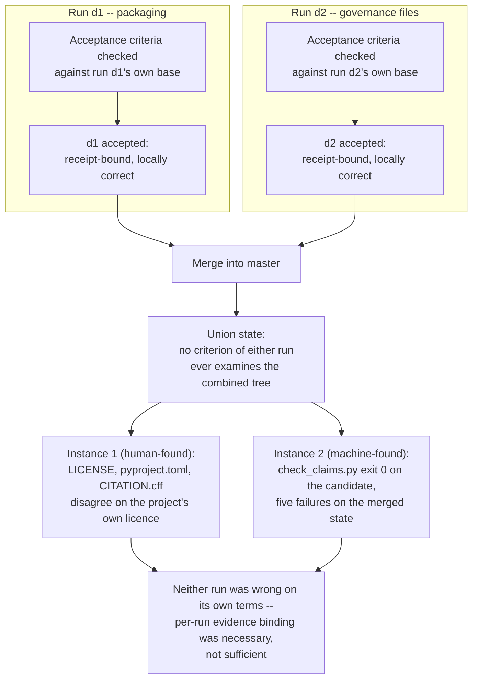
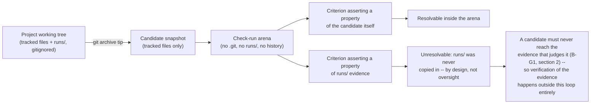

# VeriHarness — Figures

Diagrams only, no image files. Both are referenced from `POSITION_PAPER.md`
and use the same run and finding names as the prose.

## Figure 1 — per-run correctness composes; post-merge correctness does not

Illustrates §1 of the position paper: two runs, each independently
receipt-verified against its own base, merge into a state neither run's own
acceptance criteria ever examined. The license case is instance one, found
by a person; the coverage-anchor case is instance two, found by
`tools/check_claims.py` itself. Both are read from the project's own
unsupported-by-design historical count (C-052..C-054): a project-wide
consistency property that no evidence form in this ledger's schema can
positively verify from per-run receipts alone.

## Figure 2 — the arena's isolation makes `runs/` invisible to a criterion

Illustrates §6 of the position paper and `docs/LIMITATIONS.md` limit 11: a
candidate arena is materialized with `git archive <tree>`, which snapshots
exactly the tracked tree and nothing else. `runs/` is gitignored, so it is
absent from that snapshot before a check command ever runs, independent of
what the check tries to assert -- two historical counts (a `git archive`
entry count and a per-run criterion-failure count) that `CLAIMS.json` marks
unsupported rather than confirmed, since this checkout's evidence forms
cannot positively re-derive either one on their own (C-056, C-057).

